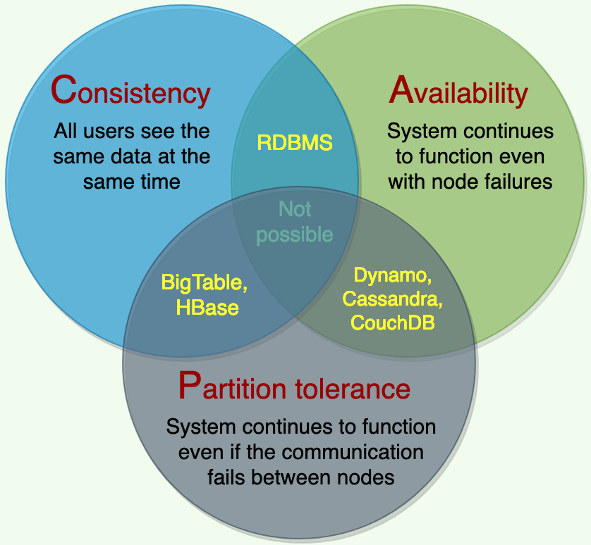

### What is CAP Theorem?

CAP Theorem dictates that a system can only be **two** of **three**:
 
1) Consistent
   1) See the same data at the same time
1) Available
   1) Healthy nodes never return an error
1) Partition-tolerant
   1) Graceful handling of network outages/splits/partitions
 

 
[source](https://www.educative.io/courses/grokking-the-system-design-interview/RMkqx1Egxqz)

### What is the requirement of Consistency in CAP Theorem?

All nodes see the same data at the same time.
 
Implementation-wise, this means that all nodes must receive updates at the same time, in sequential order.

### What is the requirement of Availability in CAP Theorem?

All requests made to healthy nodes respond with a result, without exception.

### What is the requirement of Partition-tolerance in CAP Theorem?

Nodes remain operational even if an outage splits the network into separate partitions that cannot communicate between each other.
 
Replicate continues within the Partitions until the network recovers.
 
The only exception to this is when the entire network fails.

### What is the impact of CAP Theorem on Horizontally Scalable // Distributed Systems?

Horizontal Scaling means that we have already chosen the quality of `P`artition-tolerance for handling network outages/partitions within the cluster.
 
This means that a Distributed System must choose between being either `C`onsistent or `A`vailable, but not both.
 
If a system requires `C`onsistency and `A`vailability, then it must scale vertically, such as with an RDBMS.
