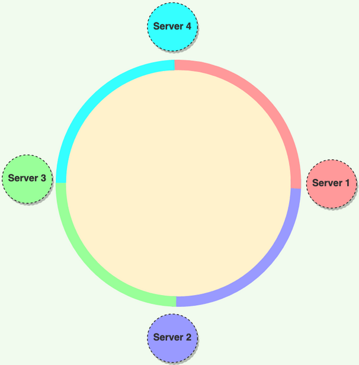
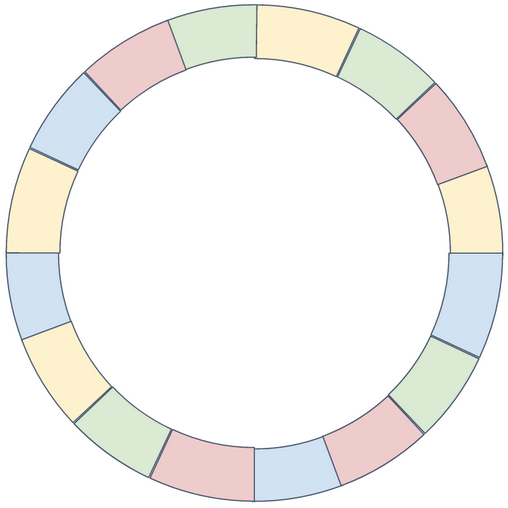

### What are 2 Challenges/Questions when Partitioning/Distributing Data?

1) How do we know which node will hold which data?
1) How do we manage data moving between nodes?
   1) Minimize total necessary moves
   1) Handle when nodes join/added or leave/removed

### What problem does Consistent Hashing solve?

It solves the problem of "Static Hashing," where the **number of servers is static**.
 
If the static number of servers changes up/down then the hashing is broken and must be migrated (with downtime) to rebalance.
 
It also leads to unbalanced partitions.
 
Consistent Hashing allows for servers to join/leave the ring with a minimal amount of rebalancing and without incurring downtime.

### What is Consistent Hashing?

It's a partitioning algorithm that sub-divides `n` physical nodes across a ring with `k` (e.g. 232) `virtual nodes`, which distributes the physical nodes both randomly and roughly-evenly around the ring.
 
Physical nodes can be assigned weights to modify the evenness of distribution.
 
It also supports replicating the content of `node_i` to nodes `i` through `i + r`, where `r` is the `replication factor`.
 
The raw physical nodes look like:
 

 
With virtual nodes, it looks like:
 

### How does Consistent Hashing maintain Random & Even Distribution across the Ring?

There are a couple of options:
 
1) Use a distinct hashing algorithm for each virtual "slice" of a physical node
1) Use the same hashing function recursively, up to `k` times, where each nested level corresponds to a virtual "slice"
 
The important thing is to ensure that you avoid collisions.
 
The data layer keeps track of:
 
1) Mapping virtual nodes to physical nodes
1) Mapping stored values to their virtual owner

### How does Consistent Hashing know which node will hold which data?
 
Each value has a partition tuple/key, which is hashed and modulo'd into a virtual "slot" to then search clock-wise for the next nearest virtual node.

### How does Consistent Hashing manage Data Moving between nodes?

When a new node is added to the ring, it is allocated its own virtual nodes, and it takes ownership of the relevant, in-range items.
 
When a node leaves the ring, ownership of each virtual node's items is transferred to the next, clock-wise virtual node.

### What is the average, per-server Load in a Consistent Hashing Datastore?

Use of virtual nodes maintains an average `1/n` load per server, where `n` is the total number of items stored in the datastore.

### Consistent Hashing should make How Many `k` Slices of each Physical Node?

Use `k ≈ `log2`(num_items)` to obtain reasonably balanced loads for storing a total of `num_items` in the entire datastore

### How does Consistent Hashing replicate data?

You define a replication factor, `r`, so that data will exist on `r` nodes.
 
Each item/key is owned by a `coordinator node`, which acts as the owner of that item.
 
According to CAP, a consistent hashing datastore must choose between `C`onsistency or `A`vailability.
 
If `A`vailability is chosen, then the datastore is eventually consistent and replication occurs async.

### When should you consider using Consistent Hashing?

* If the data-load can be highly variable and needs to scale dynamically, e.g. during Christmas
* If it's desired to modify the number of physical nodes/servers
* As a way to achieve a highly-available, replicated datastore
