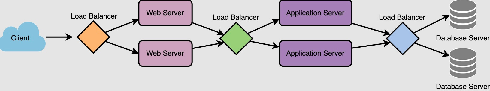

### Where are the 3 Places you can generally add a Load Balancer?

1) Client -> LB -> Web Servers
2) Web Servers -> LB -> Application Servers
3) Application Servers -> LB -> Database Servers
 

### What are some Benefits of Load Balancers?

ALAF: Availability, Latency, Analytics, & Failures
 
* Increased Availability
* Both Lower Latency for users and Easier Maintainability for system managers
* "Smart" LBs provide Predictive Analytics, such as predicting:
  * Expected volume, relative to datetime user patterns, e.g. high usage during business hours
  * Expected volume, relative to internal workloads, e.g. batch processing schedules
  * Expected latency, relative to scaling out, e.g. time to spin-up
* Solves the Single Point of Failure Problem for the Target Resource
  * (The LB itself should be made redundant so that it's not a SPoF)

### How to avoid Load Balancer being a Single Point of Failure?

* Form a Redundant Cluster, with one LB being the `active` one and another LB being the `passive` one
* The LBs monitor each other's health
* If the `active` LB becomes unhealthy, then the `passive` LB takes over

### What are the 2 Responsibilities of a Load Balancer?

1) Conduct Health Checks of its Targets
2) Algorithmically Route Requests to Healthy Targets

### What are 6 Common Load Balancing Algorithms?

1) Round Robin
2) Round Robin, Weighted
3) Least Num Connections
4) Least Response Time
5) Least Bandwidth
6) IP Hash

### What is the 'Round Robin' Load Balancing Algorithm?

* Simple: just Circularly Iterate through the Targets

### What is the 'Weighted Round Robin' Load Balancing Algorithm?

* Like Round Robin, but each Target has an assigned Immutable Weight
* A Target with a Weight of 6 will receive twice as many requests as a Target with a Weight of 3

### What is the 'Least Num Connections' Load Balancing Algorithm?

* Choose the Target with the Fewest Active Connections

### When is 'Least Num Connections' Load Balancing Useful?

* Useful for Distributing Persistent Connections, e.g. Websockets

### What is the 'Least Response Time' Load Balancing Algorithm?

* Choose the Target with the Lowest `score`
* `score` == `num_active_connections` * `avg_response_time`

### What is the 'Least Bandwidth' Load Balancing Algorithm?

* Choose the Target that has the current Lowest Mbps
* (Measured over something like the previous 14 seconds)

### What is the 'IP Hash' Load Balancing Algorithm?

* The client's IP provides a deterministic hash so that clients are redirected to the same server for as long as they are healthy

### What is Shuffle Sharding?

It's a retry technique that mitigates the impact of errors by distributing requests across shards that envelope a defined combination of instance resources.
 

 
[[source](https://aws.amazon.com/blogs/architecture/shuffle-sharding-massive-and-magical-fault-isolation/)]
 
(In AWS, they interact nicely with Route 53 Infima's [RubberTrees](https://aws.amazon.com/blogs/architecture/aws-and-compartmentalization/)).
