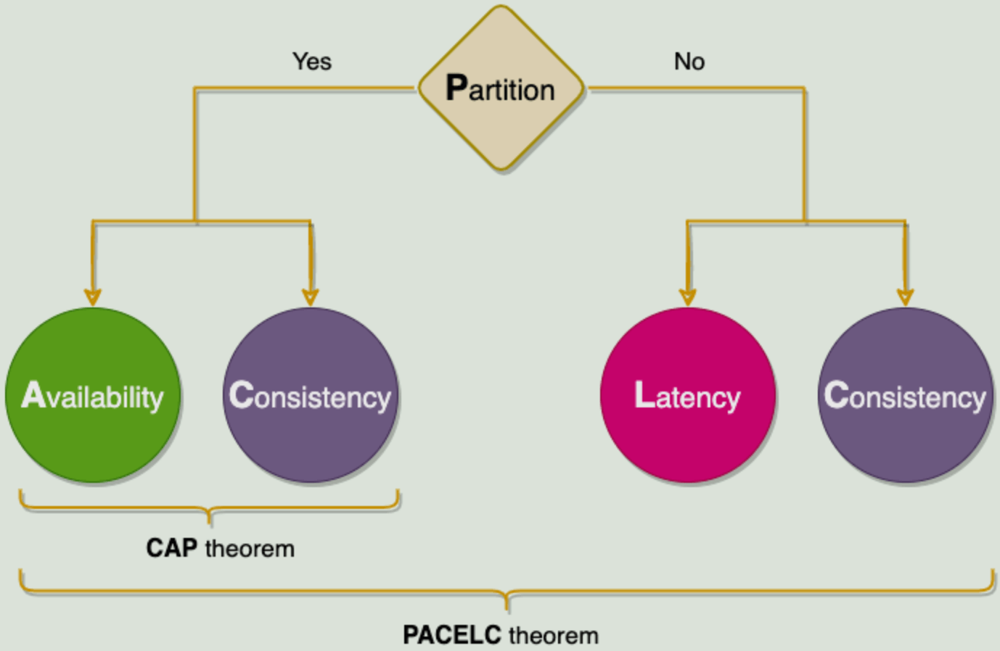

### What is PACELC?

(Pronounced "pass-elk")
 
PACELC is an extension to CAP Theorem, which states:
 
* If a `Partition-tolerant` system experiences a network outage then choose between:
  * `Availability`
  * `Consistency`
* `Else` (if there is *not* a network outage) then choose between:
  * `Latency`
  * `Consistency`
 
The choice between `Latency` vs. `Consistency` arises from using `Replication` to achieve `Availability`, i.e. the replication occurs either quickly or consistently.
 

 
[source](https://www.educative.io/courses/grokking-the-system-design-interview/39RwZr5PBwn)

### Which of these pairs prefers Low Latency and which one prefers Consistency?
 
A) Cassandra / DynamoDB
 
B) HBase / BigTable

Cassandra & DynamoDB optimize for Availability and therefore have lower latency.
 
HBase & BigTable optimize for Consistency.
