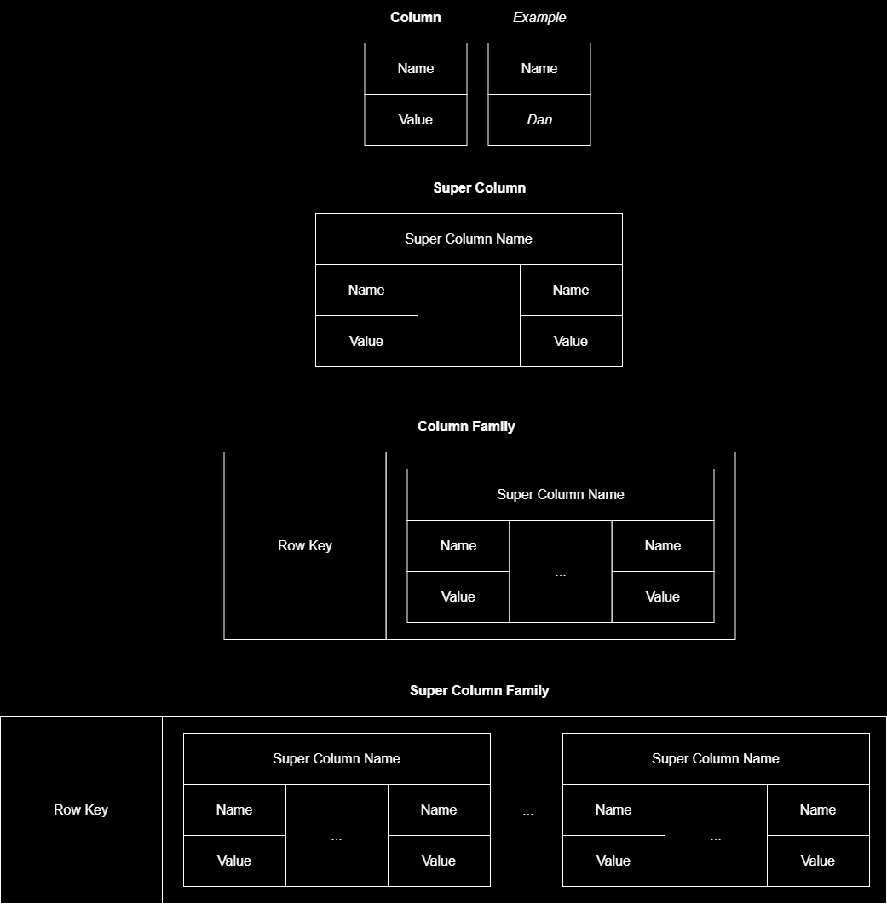
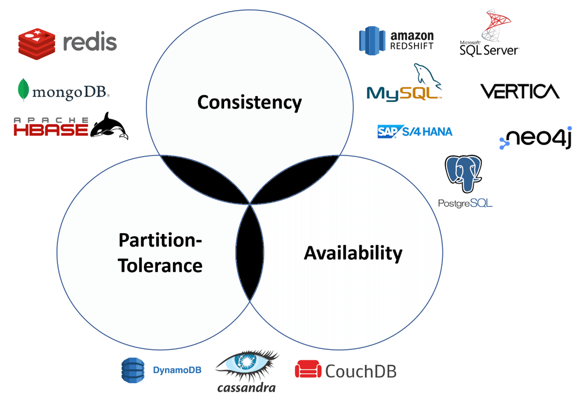

### What is the "Third Normal Form" (3NF)?

It means that *all* the columns in an RDBMS are functionally dependent on solely the primary key. [wiki](https://en.wikipedia.org/wiki/Third_normal_form)

### What are ACID Compliant DBs?

1) Atomic - all or nothing transaction commits
2) Consistent - writes enforce all constraints, and reads access the most recent write
3) Isolated - contextual transactions, controllable via locks
4) Durable - committed writes are never lost; often via a WAL (write-ahead log)

### What are 5 types of NoSQL Databases?

1) Key:Value DBs 
   1) e.g. Redis, Voldemort, DynamoDB
1) Document DBs
   1) e.g. MongoDB, CouchDB
1) Column-Wide DBs (Rows of Column-Families)
   1) e.g. Cassandra, HBase (Hadoop), BigTable
2) Columnar DBs
   1) e.g. Redshift
3) Graph DBs
   1) e.g. Neo4J, InfiniteGraph, AWS Neptune

### What is the `CAP` Difference between Redis & DynamoDB?

Redis is `Consistent`; DynamoDB is `Available`.
 
(They are both `Partition-Tolerant`).

### How do Key:Value DBs work?

Keys are unique and point to a primitive value.
 
Values can only be retrieved via keys.

### How do Document DBs work?

Document DBs are similar to Key:Value DBs in that Document DBs also have keys pointing to values.
 
However, Document DBs support a wider range of database operations:
* Query on fields other than the primary key
* Query multiple records at once
* Index on custom fields
* Primary key is typically system generated

### What are the 2 Types of Column-Oriented DBs?

1) Column-Wide DBs, e.g. Cassandra
1) Columnar DBs, e.g. Redshift

### What are 4 Differences between Column-Wide vs. Columnar DBs?

1) Column-Wide is useful for `Unstructured Data`; Columnar is useful for `Structured/Semi-Structured Data`
1) Column-Wide writes `Contiguous Column-Family-Rows` to disk; Columnar writes `Contiguous Columns` to disk
1) Column-Wide scales to `Infinity`; Columnar scales to `~2 Petabytes`.
1) Column-Wide is useful for `Write-heavy OLTP`; Columnar is useful for `Compute-heavy OLAP`

### How do Column-Wide DBs work?

Column-Wide DBs can be thought of as "two-dimensional Key:Value DBs," which support unstructured data, i.e. rows with various columns of different types in the same table/collection.
 
i.e. `(primary_key, column_name)` -> `value`
 
The "wide column" refers to the paradigm of collections with defined `Column Families`, i.e. supersets of columns:
 

 
[source](https://dandkim.com/wide-column-databases/)
 
These families/supersets represent the "row-like" unit that is stored contiguously on disk.
 
This is different than genuine, Columnar DBs, which store columns separately on disk.

### How do Columnar DBs work?

Traditional, row-based DBs store an entire row's data in a contiguous storage block, which means that "plucking" a column across rows requires reading across block offsets.
 
Otoh, Column-Wide DBs store columns in contiguous blocks, which means that reads are block-continuous and thus more performant for columnar access.
 
It's also possible for the column to be better compressed via [run-length encoding](https://en.wikipedia.org/wiki/Run-length_encoding) because the entropy of columns is usually lower than that of rows.

### How does Neo4J (a Graph DB) work?

* Neo4J is a `Native Graph DB`
  * i.e. it supports `Index-Free Adjacency`
* Writes consist of:
  * A Relationship Record
  * Updating `node_a` with `node_b`
  * Updating `node_b` with `node_a`
* It is ACID compliant to guarantee the above writes
* Uses the `Cypher` Query Language

### What is `Index-Free Adjacency` in Graph DBs?

* Query operations scale with the number of siblings for a given node
  * An RDBMS would use a B-Tree, which scales with the total size of the table
* This is achieved by having each node hold native/first-class memory-pointers to their first-degree siblings
  * An RDBMS would have multiple rows with indexed, foreign keys
* First-degree queries take `O(m)` time, where `m` is the number of immediate siblings for a given node
  * An RDBMS would take `m•log(n)`, where `n` is the total number of rows in the table

### What are 4 Differences between SQL vs. NoSQL?

1) SQL DBs are `relational`; NoSQL DBs are not
1) SQL DBs have `predefined` schemas; NoSQL DBs have `dynamic` schemas
1) SQL DBs are `vertically` scalable; NoSQL DBs are `horizontally` scalable
1) SQL DBs have `row-oriented tables`; NoSQL DBs have `key:values / documents / column-oriented tables / graphs`

### What is OLTP?

* OLTP = OnLine Transactional Processing
* Useful as a distributed transactional application-datastore

### What is OLAP?

* OLAP = OnLine Analytical Processing
* Useful for distributing analytical queries

### What is the relationship between OLTP & OLAP?

OLTP distributes heavy-write loads.
 
OLAP distributes heavy-analytical-aggregation loads.
 
"OLTP is used as a system's datastore; OLAP is used to understand the datastore."
 
Typically, OLTP data will run through an ETL to be made available to the OLAP system.

### How does RedShift (a Columnar OLAP DB) work?

* Data is `Structured` or `Semi-Structured JSON`.
* The DB is ACID compliant.
* There is a single Leader node amongst a cluster of Compute nodes.
* Clients submit ANSI-SQL queries to the Leader.
 
The Leader creates a query plan, which will:
* Determine if the query needs to be run on the Leader itself, (e.g. `NOW()` function), or on the Compute nodes.
  * Running on both is not an option, and the Leader will return an error for off-spec queries.
* Compute queries will be distributed across the cluster by the Leader compiling a query, which targets only the bare-minimum, necessary slice of data.
* The individual Compute results wil be aggregated by the Leader and returned to the client.

### Picture the Venn Diagram of CAP for Databases:
 
CAP:
 
1) Consistent
1) Available
1) Partition-Tolerant
 
DBs:
 
1) Cassandra
1) CouchDB
1) DynamoDB
1) HBase
1) MongoDB
1) Neo4J
1) RDBMS/Postgres/MySQL/etc.
1) Redis
1) Redshift

 
[source](https://data-science-blog.com/blog/2021/10/14/cap-theorem/)
